# Rainbow Project

## Introduction

- By building a Data Engineering project from scratch, I have the opportunity to gain hands-on experience with various languages, frameworks, patterns, and tools that a Data Engineer uses throughout the product development lifecycle.

- I successfully migrated my project from local development to Google Cloud Platform, a process that took approximately four weeks. While there are still some areas for improvement, I have consistently put my best effort into developing, maintaining, and enhancing the project.

## Project Architecture

- The architecture of the project is designed based on the **Lambda Architecture** pattern. There are multiple components in this architecture as we will discuss later.

    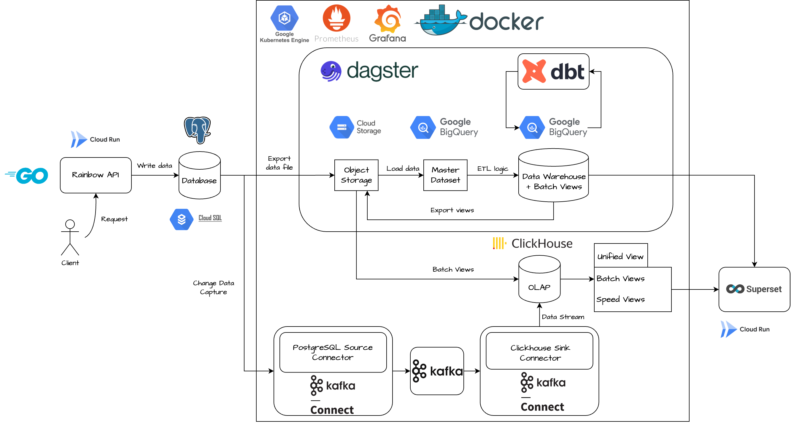

## Rainbow API

- This is our application that reflects the business process of an e-commerce platform. I assume that each time a customer places an order, the order data will be generated and stored in the database. This application is an API written in Golang that provides endpoints for managing orders.

    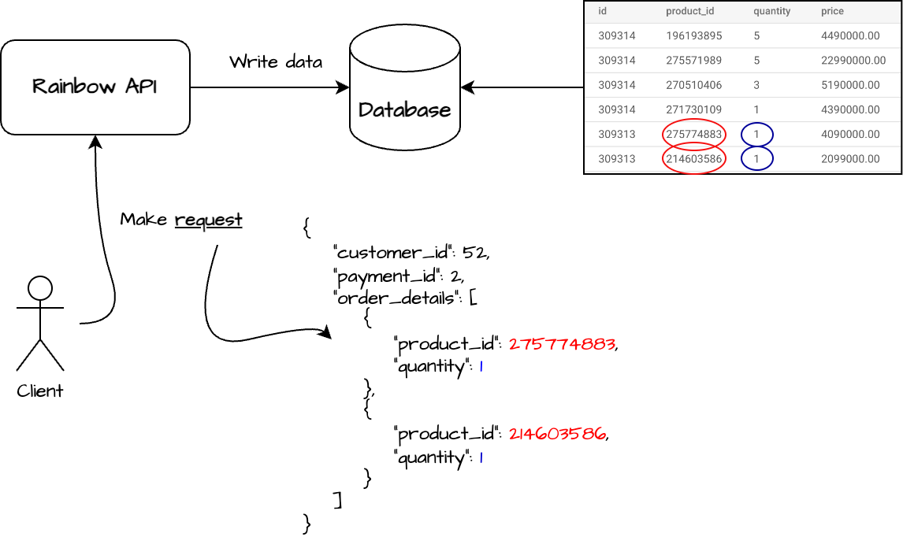

- The order data includes the ID of the customer, the payment method used, and the list of products in the order. The API allows users to retrieve a list of all orders, retrieve an order by its ID, and create a new order.

### Routes

1. **Base Routes**

    **`GET /ping`**

    - **Description**: Health check endpoint.
    - **Response**:
        - **200 OK**: The service is running.
        - **500 Internal Server Error**: Server Error.

    ---

    **`GET /`**

    - **Description**: Information about the service.
    - **Response**:
        - **200 OK**: Service information.
        - **500 Internal Server Error**: Server Error.

    ---

2. **Order Routes**

    **`GET /api/v1/orders/:id`**

    - **Description**: Retrieve an order by its ID.
    - **Parameters**:
        - `id`: The ID of the order.
    - **Response**:
        - **200 OK**: Returns the order details.
        - **404 Not Found**: Order not found.
        - **500 Internal Server Error**: Server Error.

    ---

    **`GET /api/v1/orders`**

    - **Description**: Retrieve a list of all orders.
    - **Response**:
        - **200 OK**: Returns a list of orders.
        - **500 Internal Server Error**: Server Error.

    ---

    **`POST /api/v1/orders`**

    - **Description**: Create a new order.
    - **Request Body**:
        - `customerId`: The ID of the customer placing the order.
        - `payment_id`: The ID of the payment method used.
        - `products`: List of products in the order, each containing:
            - `productId` (int): The ID of the product.
            - `quantity` (int): The quantity of the product.
    - **Response**:
        - **201 Created**: Order created successfully.
        - **400 Bad Request**: Invalid request body.
        - **500 Internal Server**: Server Error.

### API Request Flow

- Some definitions when I mention about the API request flow:

  - **Routes**: The endpoints of the API and maps HTTP requests to corresponding controller actions.
  - **Controllers**: Controllers handles HTTP requests, extracts necessary data, and calls appropriate service methods.
  - **Services**: Services contain the business logic of your application. It performs operations, calls the repository for data access.
  - **Repositories**: Repositories are responsible for data access. It performs CRUD operations on the database.
  - **Models**: Models represent the data in the application.
  - **Unit of Work**: Unit of Work is keeps track of all the changes made to the database and commits them as a single transaction.

- When the request is being made to the API, it will go through the following steps:

    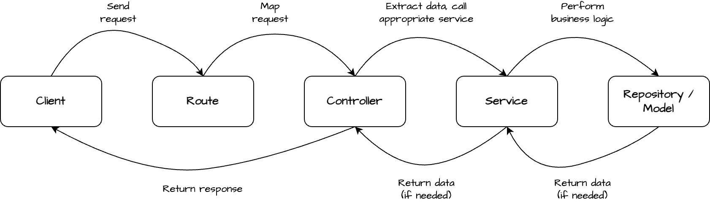

## Database

- This project uses a PostgreSQL relational database to store the data. The database schema is designed to store the order data, customer data, product data, and other relevant data.

    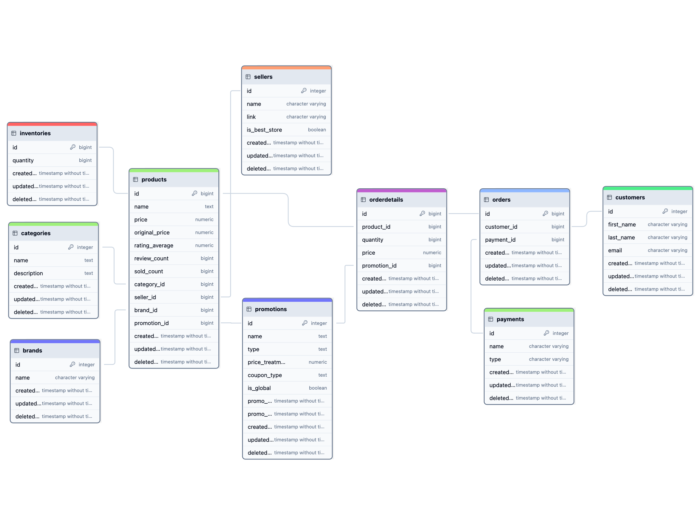

## Data Warehouse

- The amount of data of the system is constantly increasing day by day, so it is necessary to have a data warehouse to store and analyze the data.

    > **_4 Steps Dimensional Design Process ?_**
    > - **Step 1:** Select the business process.
    > - **Step 2:** Declare the grain.
    > - **Step 3:** Identity the facts.
    > - **Step 4:** Identity the dimensions.

- Our goal is to perform sales analytics using our transactional data. To achieve this, we have built a data warehouse that centralizes the sales data along with other relevant information. For this project, I am using Google BigQuery as the data warehouse solution.

### Pipeline Overview

- We built a data pipeline to extract data from the source, load it into the data warehouse and perform necessary transformations. Finally, we generate batch views to serve the needs of the Batch layer in the Lambda Architecture.

    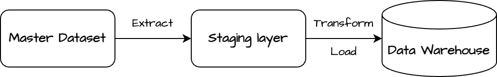

### Data Source (Master Dataset)

- This is where the raw data originates which we define it as our **Master Dataset**. This dataset is immutable and append-only, meaning that once data is written, it cannot be changed or deleted.

- We can consider this layer as a backup of the data. If something goes wrong in the data warehouse, we can always go back to the master dataset and reprocess the data.

### Staging Area

- Data from the sources is first loaded into a staging area. The schema in the staging layer is the same as the schema in the Master Dataset.

- I find some advantages of having a staging area:
  - This layer allows us to perform data consolidation and data cleaning before loading the data into the data warehouse. E.g: We can do renaming columns, converting data types to make data consistent between different sources.
  - If there are many pipelines run on different schedules, the staging area can be used to store the data temporarily before loading it into the data warehouse.

### Data Warehouse Layer

- Our target is to perform sales analytics with our transactional data, we categorize the data into star schema in data warehouse.

    > **_NOTE:_**  As our amount of data is not large, I allow the data warehouse to have data redundancy to improve query performance. Therefore, I choose to use the **star schema** instead of the snowflake schema.

    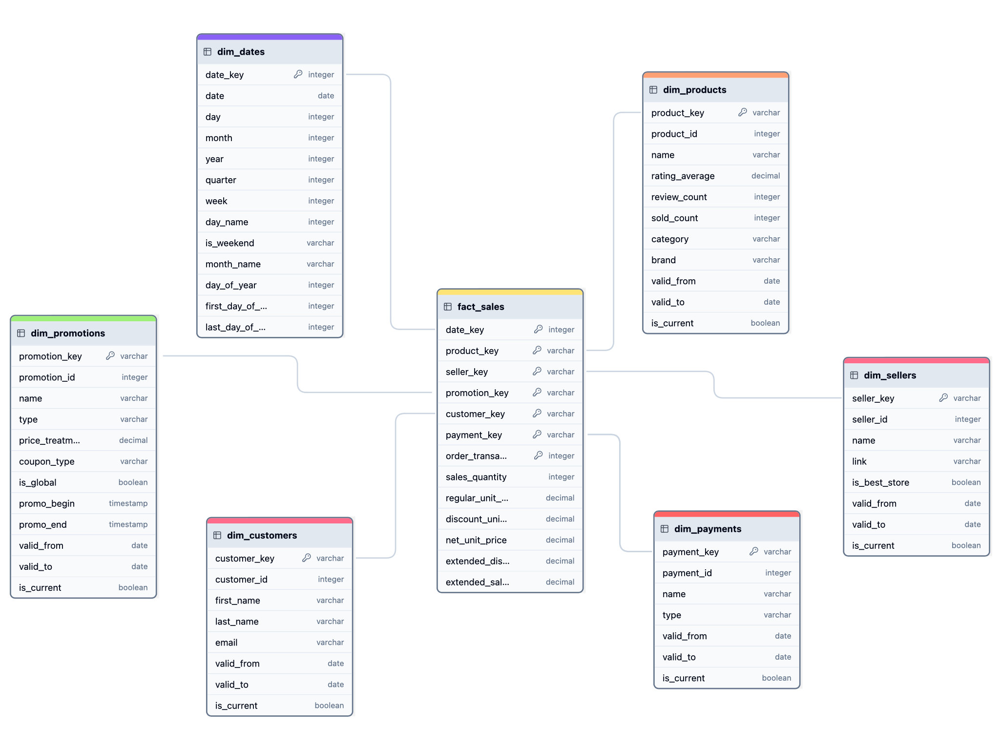

- The **star schema** involves those components:

    1. **Fact table**:

        - Our fact table **`fact_sales`** contains the quantitative data related to sales transactions of our business process. Our quantitative data or facts are sales data contain quantity of products sold (`sales_quantity`), unit and extended total amount (`regular_unit_price`, `net_unit_price`, `extended_sales_amount`), discount amount (`discount_unit_price`, `extended_discount_amount`). The fact table also contains the foreign keys to the dimension tables.
        - Granularity: Each row in a fact table is a record of an item sold.

    2. **Dimension table**:
        - Our dimension tables contain the descriptive data related to the our business process. The dimension tables are used to filter, group, or aggregate the data in the fact table.
        - Dimension tables: `dim_dates`, `dim_customers`, `dim_products`, `dim_sellers`, `dim_promotions`, `dim_payments`.

### Slowly Changing Dimensions (SCDs)

- We use the Slowly Changing Dimensions (SCDs) technique to handle changes in dimension data over time.
- In this project, I implement the SCD type 2 where a change occurs in a dimension record results in a new row added to the table to capture the new data, and the old record remains unchanged and also is marked as expired.
- For SCD Type 2, I need to include three more attributes `valid_from`, `valid_to` and `is_current` as shown below. The newest version of record will have the column `valid_to`'s value `2100-01-01` and also the column `is_current`'s value `true`.

    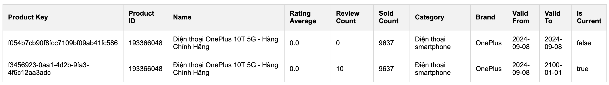

### ELT Logic

- The ELT process is responsible for extracting data from the source, loading it into the data warehouse and transforming it. I prefer this approach as it allows me to retain the orginal data in the data warehouse, also I can make use of dbt for the transformation step.

- The first step in the ELT process is data extraction from the source. The strategy for this step is to export data as flat files (here I use the parquet format) and store them in Google Cloud Storage.

    > **_NOTE:_**  I have researched and found that the parquet format is the best choice for storing data in Google Cloud Storage. Parquet is a columnar storage format that is optimized for reading and writing large datasets. Moreover, Parquet can retain the schema of the data, which makes it easier to read and write data.

- After that, extracted data is loaded into the master dataset from Google Cloud Storage. Next, the data is transferred to the staging area. To achieve this, I am using dbt to extract data from the Rainbow Database and load it into the staging area.

    > **_NOTE:_**  There are few dbt syntaxes that I use in the project. We will discuss more about dbt in the later section.

    ```sql
    SELECT
        id,
        name,
        price,
        original_price,
        rating_average,
        review_count,
        sold_count,
        category_id,
        seller_id,
        brand_id,
        promotion_id,
        updated_at
    FROM {{ source('rainbow', 'products') }}
    ```

- The next step is loading data into the dimension tables. We do this by transforming the data in the staging area, combining it with existing data in the dimension tables for the SCD Type 2, and loading it into the dimension tables.

    ```sql
    {{
        config(
            materialized='incremental',
            unique_key='product_key',
            incremental_strategy='merge'
        )
    }}

    WITH latest_version AS (
        SELECT
            id,
            name,
            rating_average,
            review_count,
            sold_count,
            category_id,
            brand_id,
            updated_at,
            ROW_NUMBER() OVER (PARTITION BY id ORDER BY updated_at DESC) AS row_num
        FROM {{ ref('stg_products') }}
    ),
    current_products AS (
        SELECT
            ls.id,
            ls.name,
            ls.rating_average,
            ls.review_count,
            ls.sold_count,
            ls.category_id,
            ls.brand_id,
            dc.name AS category,
            db.name AS brand,
            ls.updated_at
        FROM latest_version ls
        JOIN {{ ref('dim_categories') }} AS dc ON ls.category_id = dc.category_id
        JOIN {{ ref('dim_brands') }} AS db ON ls.brand_id = db.brand_id
        WHERE row_num = 1
    ),
    existing_products AS (
        SELECT DISTINCT
            dp.product_key,
            dp.product_id,
            dp.name,
            dp.rating_average,
            dp.review_count,
            dp.sold_count,
            dp.category,
            dp.brand,
            dp.valid_from,
            EXTRACT(DATE FROM cp.updated_at) AS valid_to,
            FALSE AS is_current
        FROM {{ this }} AS dp
        JOIN current_products AS cp ON dp.product_id = cp.id
        WHERE dp.is_current = TRUE
        AND (
            dp.name != cp.name OR
            dp.rating_average != cp.rating_average OR
            dp.review_count != cp.review_count OR
            dp.sold_count != cp.sold_count OR
            dp.category != cp.category OR
            dp.brand != cp.brand
        )
    ),
    new_products AS (
        SELECT DISTINCT
            cp.id AS product_id,
            cp.name AS name,
            cp.rating_average AS rating_average,
            cp.review_count AS review_count,
            CAST(cp.sold_count AS INT64) AS sold_count,
            cp.category AS category,
            cp.brand AS brand,
            EXTRACT(DATE FROM cp.updated_at) AS valid_from,
            DATE '2100-01-01' AS valid_to,
            TRUE AS is_current
        FROM current_products AS cp
        LEFT JOIN {{ this}} AS dp ON cp.id = dp.product_id
        WHERE dp.product_id IS NULL
        OR (
            dp.is_current = TRUE AND
            (
                dp.name != cp.name OR
                dp.rating_average != cp.rating_average OR
                dp.review_count != cp.review_count OR
                dp.sold_count != cp.sold_count OR
                dp.category != cp.category OR
                dp.brand != cp.brand
            )
        )
    )
    SELECT 
        product_key,
        product_id,
        name,
        rating_average,
        review_count,
        sold_count,
        category,
        brand,
        valid_from,
        valid_to,
        is_current
    FROM existing_products
    UNION ALL
    SELECT 
        generate_uuid() AS product_key,
        product_id,
        name,
        rating_average,
        review_count,
        sold_count,
        category,
        brand,
        valid_from,
        valid_to,
        is_current
    FROM new_products
    ```

    > **_NOTE:_**  We will go from the end of the query to the beginning. The query first defines the `new_products` CTE, which selects the new products that are not in the existing products or the new version of the existing products. The `existing_products` CTE selects the existing products that have changed. The `current_products` CTE selects the latest version of the products from the staging area.

- The final step is loading data into the fact table. We do this by transforming the fact data in the staging area, combining it with data from the dimension tables, and loading it into the fact table.

    ```sql
    {{
        config(
            materialized='incremental',
            unique_key=['date_key', 'product_key', 'seller_key', 'promotion_key', 'customer_key', 'payment_key', 'order_transaction'],
            incremental_strategy='merge'
        )
    }}

    WITH product_seller AS (
        SELECT
            id,
            seller_id
        FROM {{ ref('stg_products') }}
        GROUP BY id, seller_id
    )
    SELECT
        dd.date_key,
        ldp.product_key,
        lds.seller_key,
        ldprom.promotion_key,
        ldc.customer_key,
        ldpay.payment_key,
        so.id AS order_transaction,
        sod.quantity AS sales_quantity,
        sod.price AS regular_unit_price,
        CASE
            WHEN ldprom.coupon_type = 'Percentage' THEN ldprom.price_treatment * sod.price / 100
            WHEN ldprom.coupon_type = 'Fixed Amount' THEN ldprom.price_treatment * 1000
            ELSE 0
        END AS discount_unit_price,
        CASE
            WHEN ldprom.coupon_type = 'Percentage' THEN sod.price - (ldprom.price_treatment * sod.price / 100)
            WHEN ldprom.coupon_type = 'Fixed Amount' THEN sod.price - (ldprom.price_treatment * 1000)
            ELSE sod.price
        END AS net_unit_price,
        CASE
            WHEN ldprom.coupon_type = 'Percentage' THEN sod.quantity * (ldprom.price_treatment * sod.price / 100)
            WHEN ldprom.coupon_type = 'Fixed Amount' THEN sod.quantity * (ldprom.price_treatment * 1000)
            ELSE 0
        END AS extended_discount_amount,
        sod.price * sod.quantity AS extended_sales_amount
    FROM {{ ref('stg_orders') }} AS so
    JOIN {{ ref('stg_order_details') }} AS sod ON so.id = sod.id
    JOIN product_seller AS ps ON sod.product_id = ps.id
    JOIN {{ ref('dim_customers') }} AS ldc ON so.customer_id = ldc.customer_id AND ldc.is_current = TRUE
    JOIN {{ ref('dim_products') }} AS ldp ON sod.product_id = ldp.product_id AND ldp.is_current = TRUE
    JOIN {{ ref('dim_sellers') }} AS lds ON ps.seller_id = lds.seller_id AND lds.is_current = TRUE
    JOIN {{ ref('dim_promotions') }} AS ldprom ON sod.promotion_id = ldprom.promotion_id AND ldprom.is_current = TRUE
    JOIN {{ ref('dim_payments') }} AS ldpay ON so.payment_id = ldpay.payment_id AND ldpay.is_current = TRUE
    JOIN {{ ref('dim_dates') }} AS dd ON DATE(so.updated_at) = dd.date
    ```

    > **_NOTE:_**  The main idea of the query is to join the fact data with the dimension data and selects the necessary columns for the fact table.

### Access Layer

- With data stored in data warehouse, we can connect to visualization tools or applications for building charts, dashboards.

    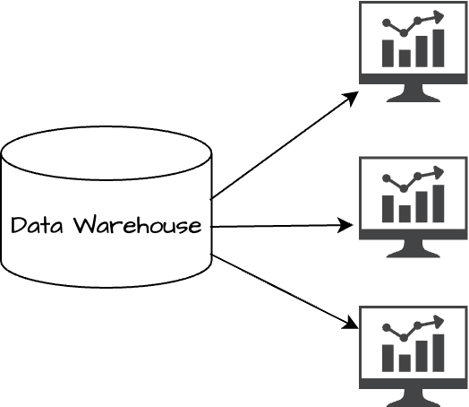

## Lambda Architecture

- Lambda Architecture is a data processing architecture that takes advantages of both batch and streaming processing methods.

    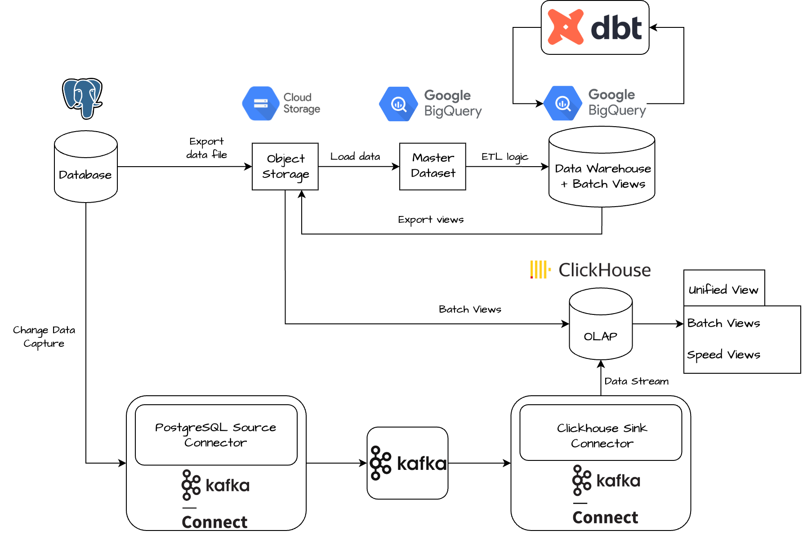

### Batch Layer

- Batch layer is responsible for 2 purposes: **Handling the historical data** and **Generating batch views** of precomputed results.

    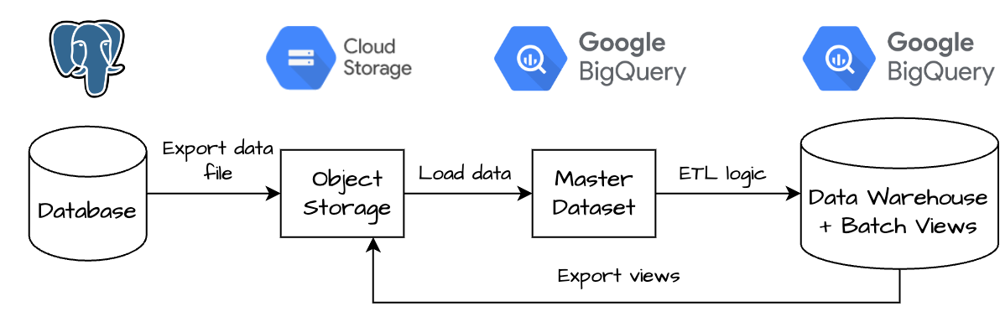

- It manages the master dataset where the data is immutable and append-only, preserving a trusted historical records of all the incoming data from source. I created a dataset `raw` for storing master dataset.

    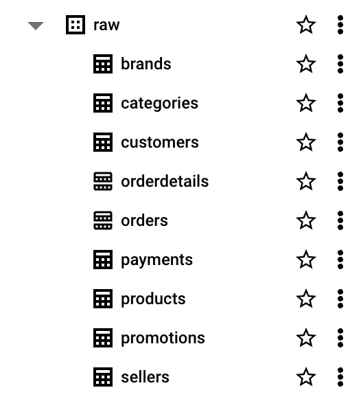

- Batch views are precomputed using BigQuery with SQL scripts. They are stored in a dataset `warehouse` and exported into flat files where OLAP Database (Clickhouse) can ingest from this.

    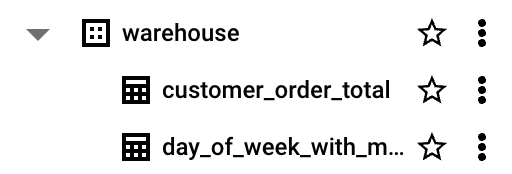

- I use this script to create a batch view for the total sales.

    ```sql
    SELECT
        SUM(fs.sales_quantity) AS total_sales_quantity,
        SUM(fs.extended_sales_amount) AS total_sales_amount,
        SUM(fs.extended_sales_amount - fs.extended_discount_amount) AS total_profit,
        MAX(dd.date) AS current_run_date
    FROM {{ ref('fact_sales') }} AS fs
    JOIN {{ ref('dim_dates') }} AS dd ON fs.date_key = dd.date_key
    ```

    > **_NOTE:_**  I use dbt to generate the batch views. The result of the dbt models is stored in the data warehouse and exported to Google Cloud Storage as flat files.

### Speed Layer

- By design, the batch layer has a high latency, typically delivering batch views to the serving layer at a rate of once or twice per day. Speed layer handles realtime data streams and provides up-to-date views.

    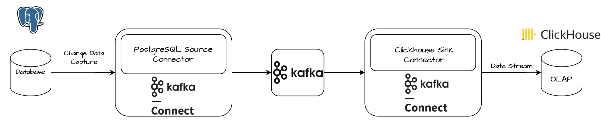

- In this project, the stream flows are just to deliver data from source (**Rainbow Database**) to our sink (**OLAP Database**) in near realtime without processing. Data after being transmitted to the destination will be aggregated and formed speed views.

    > **_NOTE:_**  I am using Kafka Connect to establish data streams from the source to sink by configuring two plugins **`io.debezium.connector.postgresql.PostgresConnector`** and **`com.clickhouse.kafka.connect.ClickHouseSinkConnector`**.

### Serving Layer

- The data serving layer receives the batch views from the batch layer and also receives the near real-time views streaming in from the speed layer.
- Serving layer merges results from those two layer into final unified views.

    

- I use this script to create a unified view for the total sales.

    ```sql
    CREATE VIEW IF NOT EXISTS rainbow.v_total_sales ON CLUSTER 'cluster'
    AS
    SELECT
        SUM(total_sales_quantity) AS total_sales_quantity,
        SUM(total_sales_amount) AS total_sales_amount,
        SUM(total_profit) AS total_profit
    FROM (
        SELECT
            total_sales_quantity,
            total_sales_amount,
            total_profit
        FROM rainbow.v_total_sales_batch
        UNION ALL
        SELECT
            total_sales_quantity,
            total_sales_amount,
            total_profit
        FROM rainbow.v_total_sales_speed
    );
    ```

    > **_NOTE:_**  The unified views are created in Clickhouse. The `rainbow.v_total_sales_batch` view is the batch view (read from flat files in Google Cloud Storage) and the `rainbow.v_total_sales_speed` view is the speed view (read from Clickhouse after ingesting from Kafka). The final view `rainbow.v_total_sales` is the unified view that combines the results from the batch and speed views.

## Data Pipeline

- Our data pipeline mainly focus on moving, transforming and organizing data to serve the need of Batch layer in the lambda architecture.
- For orchestrating, scheduling the pipeline in an automatically way, I am using open source tool called [**Dagster**](https://dagster.io/). Moreover, [**dbt**](https://www.getdbt.com/) is used for transformation steps in our data pipeline.

    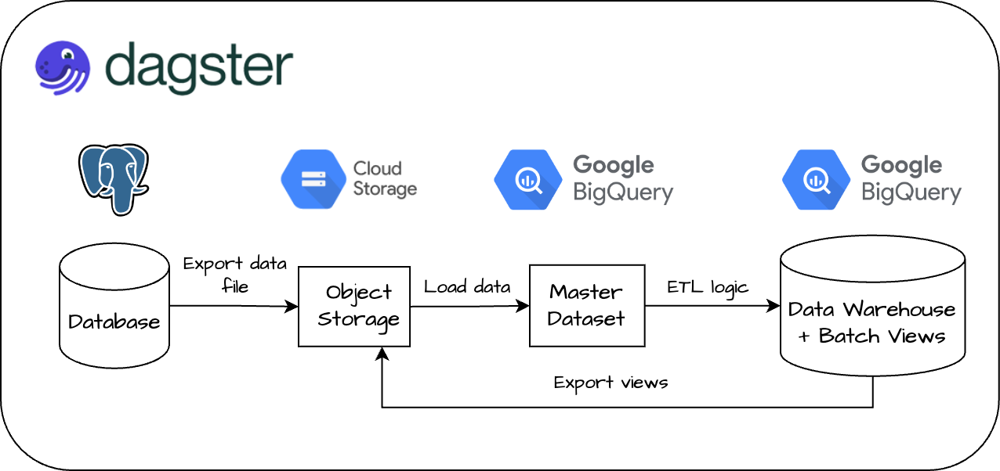

### Dagster

- Dagster models pipelines in terms of the data assets. With Dagster, I can define the data assets, their dependencies, and the transformations that need to be applied to them.

1. **Assets**
    - Dagster is asset-centric, which declare that the primary focus is on the **_data products_ (assets)** generated by the pipeline. An **asset** is an object in persistent storage, such as a table, file. In this project, I defined many assets, each asset is responsible for a result of one step.

        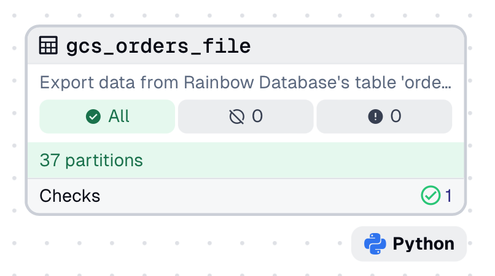

    - For example, the asset **`gcs_orders_file`** is responsible for extracting data of table `orders` from Rainbow Database and saving as a parquet file in Google Cloud Storage. Or the asset **`fact_sales`** is the fact table in our data warehouse, it is created by aggregating and transforming data from staging and dimension tables.

        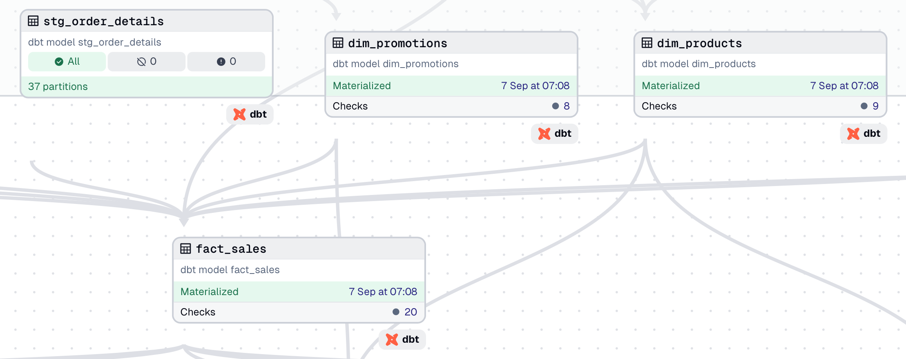

    - Dagster automatically tracks asset dependencies and it allows you to track the current state of your assets. Assume if upstream assets are materialized but the downstream assets, it will mark the state of downstream assets as `Out of sync`.
    - Dagster provides **[Asset Checks](https://docs.dagster.io/concepts/assets/asset-checks#asset-checks)** to define and execute different types of checks on your [data assets](https://docs.dagster.io/concepts/assets/software-defined-assets) directly in Dagster. This help us to perform some kind of data quality tests or data existing checks.

        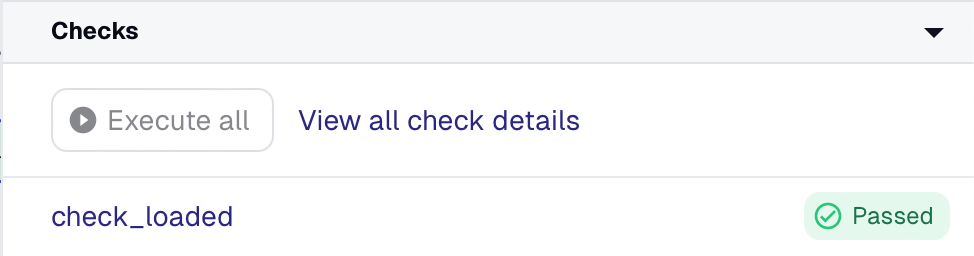

    - Dagster also allow us to provide rich metadata for each assets.

        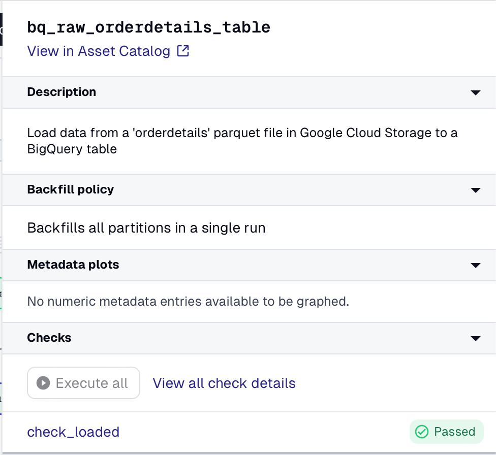

2. **Partitions & Backfill**
    - An asset definition can represent a collection of **partitions** that can be tracked and materialized independently. In other words, you can think each partition functions like its own mini-asset, but they all share a common materialization function and dependencies.
    - For example, I have a `DailyPartition` asset where each partition key represent a date like `2024-09-01`, `2024-02-09`, …

        

    - Using partitions provides the following benefits:
        - **Cost efficiency**: Run only the data that’s needed on specific partitions.
        - **Speed up compute**: Divide large datasets into smaller, allow boosting computational speed with parallel processing.
    - **Backfilling** is the process of running partitions for assets or updating existing records. Dagster supports backfills for each partition or a subset of partitions. Backfills are common when setting up a pipeline where:
        - Run the pipeline for the first time where you might want to backfill all historical and current data.
        - Scenario when you changed the logic for an asset and need to update historical data with the new logic.
    - In the project, this backfill job will materialize on all **`37`** partitions.

        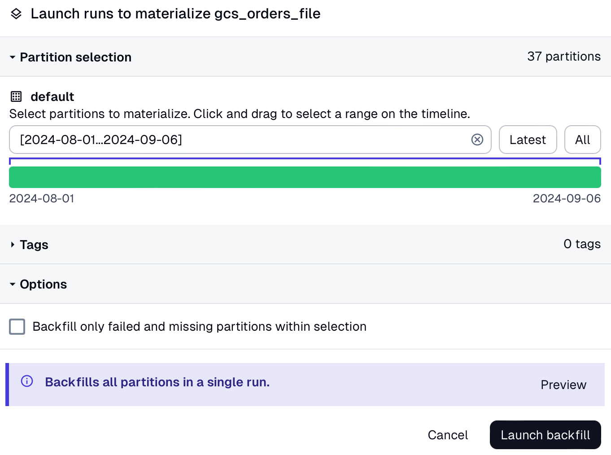

3. **Resources**
    - In data engineering, resources are the external services, tools, and storage you use to do your job.
    - In this project, the pipeline often interacts with Rainbow Database, Google Cloud Storage, BigQuery. A `gcs` resource is described as below.

        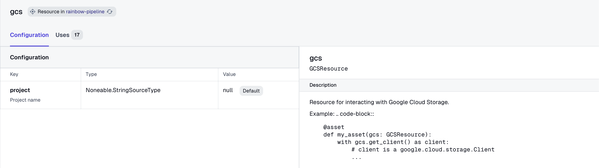

    - The concept of **resource** is similar to the concept of **connection** in Airflow. I observe that the two biggest advantages of the resource in Dagster are the reusability in code and resource dependency in asset.
4. **Assets Job**
    - [Jobs](https://docs.dagster.io/concepts/ops-jobs-graphs/jobs) are the main unit for executing and monitoring asset definitions in Dagster. An asset job is a type of job that targets a selection of assets and can be launched.
    - In this project, I define an asset job called `batch_job` with the purpose of running the whole pipeline in batch layer. This job is launched at fixed interval, by using **schedules**.

        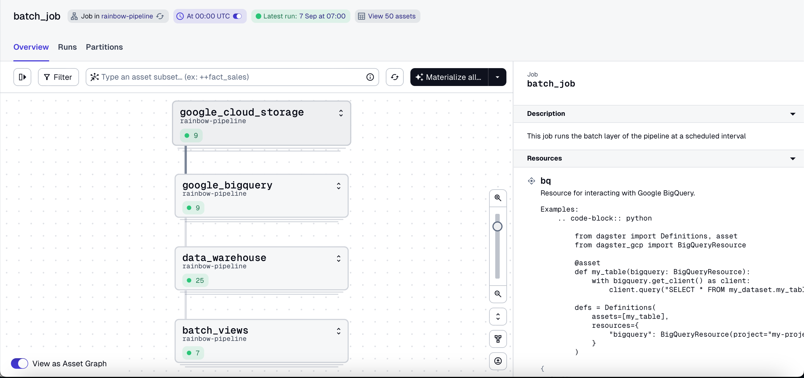

5. **Schedules**
    - Schedules are Dagster's way of supporting traditional methods of [automation](https://docs.dagster.io/concepts/automation), which allow you to specify when a [job](https://docs.dagster.io/concepts/ops-jobs-graphs/jobs) should run. Using schedules in this project, the whole pipeline is set up to run at a fixed time at **0:00 AM UTC** every day.

        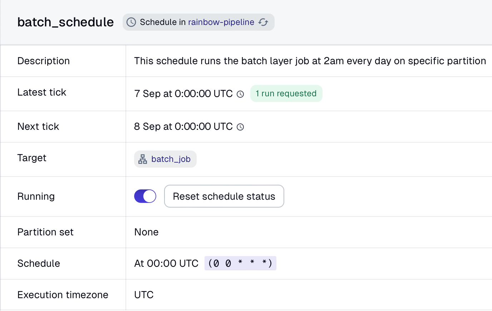

    - In this project, partitioned assets will be run on the latest partition key. In other words, if I have `DailyPartition` asset, each day the pipeline will run on the partition key of the previous date. For example, if the current date is `2024-09-02`, then the pipeline will be provided a partition key of the previous date `2024-09-01` when it starts to run.

### Dbt

- Our project consists of ELT pipeline where we extract data from Rainbow Database, transform and load them to the Data Warehouse. The letters **E** and **L** are the process of moving data between two places in which we can easily achieve this by writing script and defining them as assets in Dagster.
- The remaining letter **T** represents for the transformation step. To achieve this step, I decide to transform using SQL script and [dbt](https://docs.getdbt.com/docs/introduction) is the most suitable to this situation.
- Dbt is **a data transformation tool** that enables data analysts and engineers to transform data in a cloud analytics warehouse.

1. **Model**
    - Dbt model is essentially a SQL file that contains a transformation query. This query decides how data is transformed from its raw form to a usable form in the data warehouse.
    - The SQL query is saved as a view or table in the data warehouse. This means that we don’t need to care about scripts to create a view or a table and instead focus on the transformation logic only.
    - For example, I have a dbt model `dim_products` which represents the transformation logic of creating a dimension table for product data. Every time this dbt model runs, the new data is inserted incrementally to the table `dim_products` in our data warehouse by specifying `materialized='incremental'`. For SCD type 2, I use `incremental_strategy='merge'` to handle the changes in the data.

        ```sql
        {{
            config(
                materialized='incremental',
                unique_key='product_key',
                incremental_strategy='merge'
            )
        }}
        
        -- Logic transformation
        SELECT 
            ...
        ```

2. **Test**
    - Data tests are assertions you make about your models and other resources in your dbt project. This improve the integrity of the SQL in each model by making assertions about the results generated.
    - Data tests are SQL queries. In particular, they are `select` statements that seek to grab "failing" records, ones that disprove your assertion.
    - For example, I have a dbt test `assert_consistent_total_sales.sql` in which I want to ensure that the total sales value after transforming and loading to data warehouse is consistent to the total sales value in the raw form. This test will fail in case this query returns the count differ than 0.

        ```sql
        WITH revenue_fact_sales AS (
            SELECT
                SUM(extended_sales_amount) AS total_extended_sales_amount
            FROM {{ ref('fact_sales') }}
        ),
        revenue_raw_order_details AS (
            SELECT
                SUM(quantity * price) AS total_extended_sales_amount
            FROM {{ source('rainbow', 'orderdetails') }}
        )
        SELECT
            COUNT(*)
        FROM revenue_fact_sales
        JOIN revenue_raw_order_details
            ON revenue_fact_sales.total_extended_sales_amount != revenue_raw_order_details.total_extended_sales_amount
        ```

### Dagster & dbt

- You can think of dbt model as an asset in Dagster. When a dbt model runs, it can create a view or table in our data warehouse which we can call it as a Dagster asset. The dependencies between dbt models are also dependencies of corresponding assets in Dagster.

    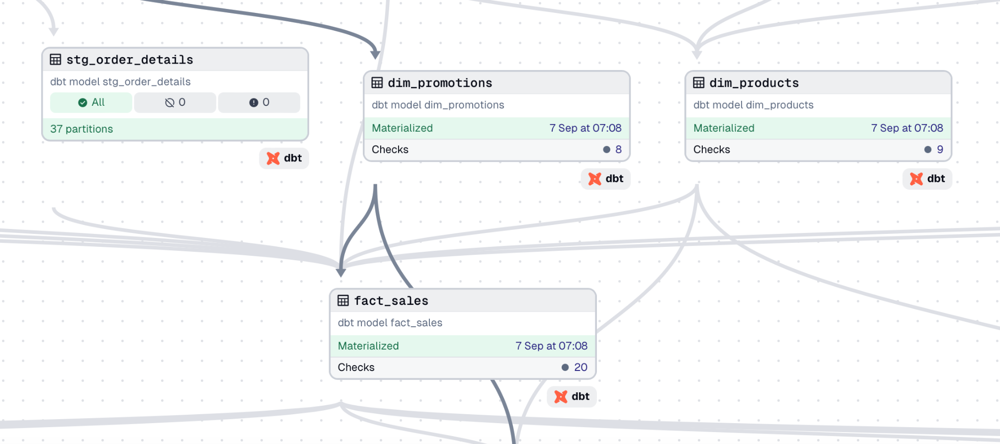

- Dagster can orchestrates, schedules the run of those dbt models. Dagster makes use of dbt tests as asset checks, therefore, it ensure the data quality when integrating them together.

    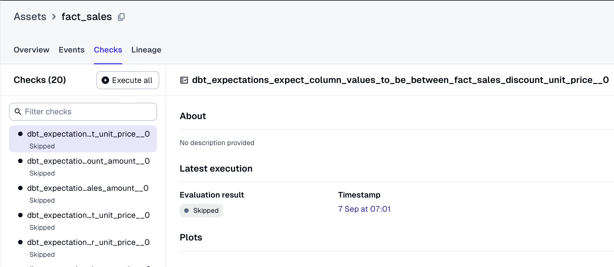

## Kafka

### Architecture

- In this project, I create a single Apache Kafka cluster with `3` brokers. Each topic within this cluster have `3` partitions and `2` replicas. The amount of data is not large, so that this setup is appropriate for serving the need of near realtime streaming.

    

  - **Message** is the Kafka’s unit of data like a row or a record of data. **Producer** publish messages into Kafka cluster. **Consumer** then consume those messages by pulling them from the system.
  - The published messages are stored in a server called **broker**. The broker receives messages from producers, assigns offsets, and writes them on disk. It also serves consumers by responding to the message fetch requests.
  - Messages are organized into **topics**. Each topic is divided into one or many **partitions**. A partition of a topic can be replicated to different brokers, so this means a topic can be scaled horizontally across multiple servers.

### Broker

- Single Kafka cluster is deployed into Kubernetes environment. Each broker lives within one separate Kubernetes pod.

    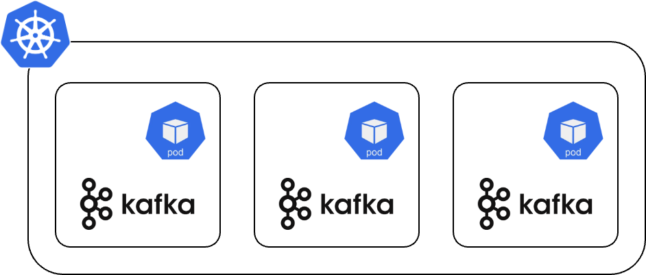

### Topic

- Messages are organized into topics. For each table in Rainbow Database, it has a corresponding topic. E.g: Kafka will create a topic `products` for capturing data changes from table `products`.

    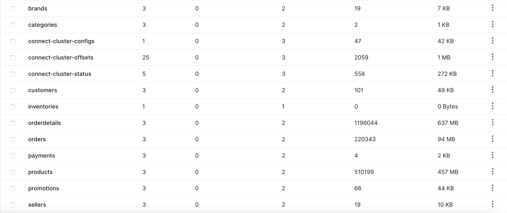

- **Debezium** acts as the Kafka producer which it capture changes (inserts, updates, deletes) from our Rainbow Database. After capturing these changes, Debezium publishes them as events to Kafka topics.
- The **Clickhouse Sink Connector** serves as the Kafka consumer which it subscribes to the relevant topics and then writes the consumed data into the appropriate tables in ClickHouse.

    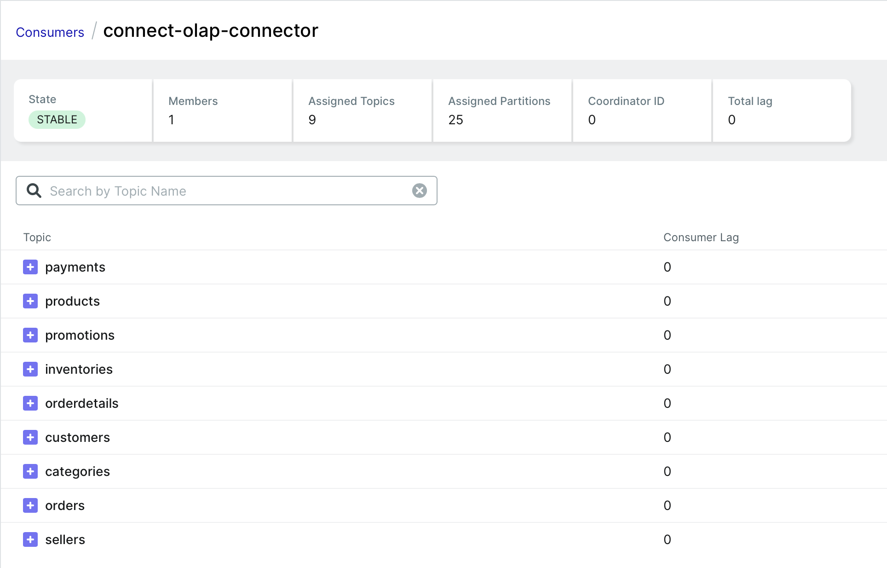

## OLAP

- The serving layer of the Lambda Architecture is meant to provide near real-time analytics.
- Clickhouse is used as an OLAP Database in the Serving layer. ClickHouse uses a columnar database model, so it fits the requirements of delivering near real-time data and views due to fast query execution.
- Clickhouse get precomputed batch views by ingesting from GCS and receives real-time data by ingesting from Kafka.

    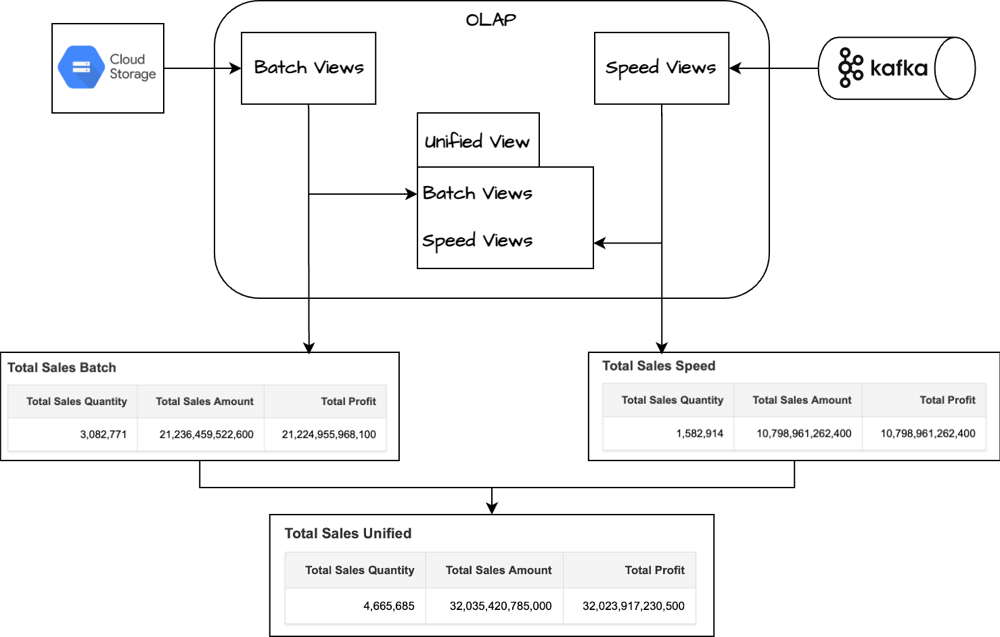

## Visualization

- I use Apache Superset for creating and building charts, dashboards. In this project, I want to have analysis on sales data along with others data.

### Total Sales

- Analyze the total quantity of products sold and the total amount of revenue generated.

    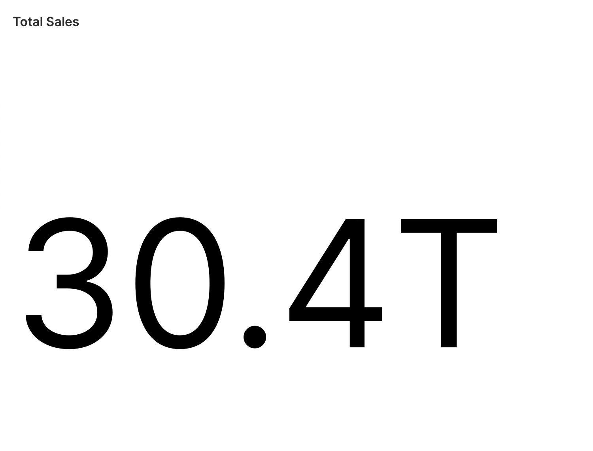

### Day Of Week With Most Sales

- Determine which day of the week experiences the highest sales volume. It helps in identifying peak sales days, useful for inventory management and marketing campaigns.

    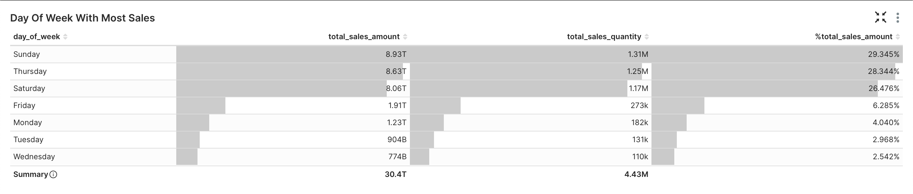

### Top Sellers

- Identify and display the top-performing sellers.

### Top 5 Most Profitable Products By Category

- Analyze the top 5 products with the highest profit within each category.

### Most Common Payment Methods

- Visualize the distribution of payment methods used by customers (credit card, cash, …).

### Customer Ranking

- Rank customers based on metrics such as total purchases
